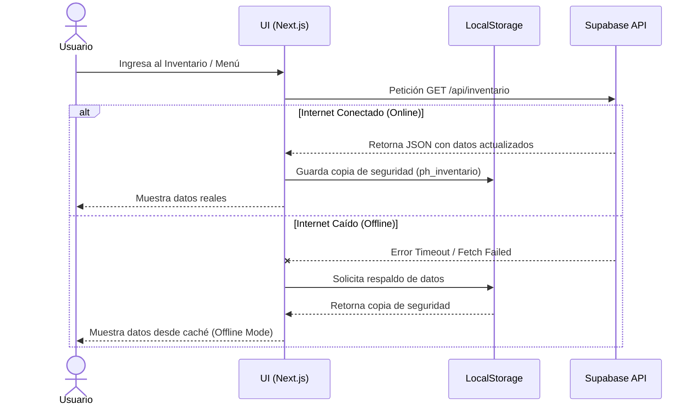

# 📄 Propuesta del Sistema **Puerto Habana**

Este documento detalla los requerimientos, la arquitectura y los costos del proyecto **Puerto Habana**, un sistema de gestión integral para restaurantes con 4 portales principales más un panel de administración.

---

## 1️⃣ Tablas de Requerimientos

### 1.1 Requerimientos Funcionales (RF)
Los requerimientos funcionales definen lo que el sistema debe hacer para cada tipo de usuario.

| ID | Módulo | Funcionalidad | Descripción |
|---|---|---|---|
| **RF-01** | Autenticación | Login por Portal | Cada empleado (Mozo, Cocina, Lavaplato, Desarrollador) debe iniciar sesión en un portal específico (`/login-mozo`, etc.) usando su email. |
| **RF-02** | Dashboard | Perfil de Usuario | Todo el personal debe poder visualizar y editar sus datos personales (teléfono, turno, etc.) desde su panel. |
| **RF-03** | Dashboard | Registro de Pagos | Los empleados pueden ver un historial de todos los pagos que el restaurante les ha realizado. |
| **RF-04** | Ventas (Mozo) | Toma de Pedidos | El Mozo debe poder registrar pedidos de mesas mediante un menú digital cargado desde el inventario. |
| **RF-05** | Cocina | Gestión de Órdenes | La Cocina debe visualizar los pedidos entrantes en tiempo real, cambiar su estado a "Entregado" y ver su historial diario. |
| **RF-06** | Inventario | Sincronización Real | Al realizarse una venta desde el portal del Mozo, el stock de comida, bebidas y tapers se debe descontar automáticamente. |
| **RF-07** | Admin | Gestión de Personal | El Administrador puede dar de alta a nuevos empleados, asignar salarios y roles específicos. |
| **RF-08** | Admin | Control de Pagos | El Administrador puede realizar y registrar pagos al personal. El sistema debe autocompletar el monto base del empleado. |
| **RF-09** | Notificaciones | Pedidos (Mozo a Cocina) | Al registrar un pedido, la Cocina y el Administrador reciben una notificación push. |
| **RF-10** | Notificaciones | Pedidos Listos (Cocina a Mozo) | Al terminar un pedido, la Cocina envía una notificación push únicamente al Mozo que lo solicitó. |
| **RF-11** | Notificaciones | Pagos de Salario | Al registrar un pago, el empleado específico (Mozo, Cocina, Lavaplato, Dev) recibe una notificación de que su pago fue realizado. |
| **RF-12** | Notificaciones | Recordatorio de Cierre | El sistema debe enviar una notificación push automática al Administrador a las 17:00 hrs para recordarle generar el reporte del día. |

### 1.2 Requerimientos No Funcionales (RNF)
Los requerimientos no funcionales definen cómo el sistema realiza sus funciones (calidad, experiencia, seguridad).

| ID | Categoría | Descripción |
|---|---|---|
| **RNF-01** | **Interfaz (UI/UX)** | Diseño premium "Glassmorphism" con tipografía moderna (Inter), paleta de colores coherente y retroalimentación interactiva (hover, micro-animaciones). |
| **RNF-02** | **Disponibilidad Offline** | El sistema debe funcionar en un 80% si se cae el internet. El inventario, personal y menú se almacenan en `localStorage` (caché local). |
| **RNF-03** | **Sincronización Diferida** | Las acciones realizadas sin internet (ej. registrar un pago) se guardarán en local y se enviarán automáticamente a Supabase al recuperar la red. |
| **RNF-04** | **Seguridad** | Rutas protegidas mediante validación de sesión (Tokens en Storage). |

---

## 2️⃣ Arquitectura y Diagramas UML

### 2.1 Diagrama de Casos de Uso
A continuación, se muestra el modelo de interacción de los actores principales con el sistema:

```mermaid
usecaseDiagram
    actor "Administrador" as admin
    actor "Mozo" as mozo
    actor "Cocina" as cocina
    actor "Lavaplato/Dev" as staff
    
    package "Sistema Puerto Habana" {
        usecase "Gestionar Inventario" as UC1
        usecase "Gestionar Personal y Pagos" as UC2
        usecase "Tomar Pedidos de Clientes" as UC3
        usecase "Descontar Stock" as UC4
        usecase "Preparar Órdenes" as UC5
        usecase "Consultar Historial de Pagos" as UC6
        usecase "Recibir Notificaciones Personalizadas" as UC7
    }
    
    admin --> UC1
    admin --> UC2
    admin --> UC7
    
    mozo --> UC3
    UC3 ..> UC4 : <<include>>
    mozo --> UC7
    
    cocina --> UC5
    cocina --> UC7
    
    staff --> UC6
    staff --> UC7
    mozo --> UC6
    cocina --> UC6
```

### 2.2 Diagrama de Secuencia: Sincronización y Modo Offline
Este diagrama muestra cómo el sistema maneja la red y el fallback (plan de respaldo) con el `localStorage`.



---

## 3️⃣ Funcionamiento y Uso de los Portales

1. **Dashboard Mozo:** Menú dinámico que carga el inventario real. Permite tomar la orden, agrupar mesas, facturar y revisar los pagos recibidos.
2. **Dashboard Cocina:** Panel oscuro de alto contraste diseñado para estar siempre en pantalla. Las órdenes aparecen y el cocinero las marca como completadas.
3. **Dashboard Lavaplato:** Panel simplificado y claro enfocado exclusivamente en revisar su información de contacto y sus pagos recientes.
4. **Dashboard Desarrollador:** Espacio técnico privado (con estética púrpura) donde el programador puede verificar sus pagos y acceder a su perfil sin que los clientes vean el link.
5. **Dashboard Administrador:** El "cerebro" de todo. Puede registrar empleados (incluyendo al dev), pagar salarios, ver reportes de ventas, ingresos, y ajustar el inventario.

---

## 4️⃣ Estimación y Presupuesto Comercial

El proyecto tiene un alcance de **4 portales funcionales para el staff** + **1 portal completo de administración**, integración con base de datos real (Supabase), funcionamiento offline y un diseño UI/UX Premium.

| Concepto | Detalle del Trabajo | Costo Estimado |
|----------|---------------------|----------------|
| **Desarrollo Front-End** | 5 Dashboards interactivos, ruteo privado, diseño responsivo y lógica de negocio en Next.js. | S/ 800.00 |
| **Diseño Premium UI/UX** | Sistema de diseño Glassmorphism, animaciones, tipografía estandarizada. | S/ 300.00 |
| **Sistemas de Notificaciones Push**| Implementación de notificaciones en tiempo real, personalizadas por empleado y tareas automáticas. | S/ 300.00 |
| **Desarrollo Back-End y Base de Datos** | Endpoints de Supabase, gestión de tablas relacionales (Inventario, Usuarios, Pagos, Pedidos). | S/ 200.00 |
| **Ingeniería Offline** | Lógica de respaldo en `localStorage`, sincronización de datos diferida y tolerancia a fallos. | S/ 200.00 |
| **Despliegue y QA** | Pruebas de flujo completo, resolución de bugs, alojamiento y puesta en marcha. | S/ 200.00 |
| **TOTAL A PAGAR** | **Cotización preferencial acordada para el dueño** | **S/ 2,000.00** |

> **Nota Adicional:** El sistema se entrega completamente operativo. El uso de la base de datos a través de Supabase está en su capa gratuita, por lo que **no hay costos de mantenimiento mensual de servidores** para el dueño del local en esta etapa.

---

### 📬 Próximos pasos
Si se aprueba este documento técnico y comercial, procederemos con las últimas pruebas integrales del sistema y la entrega final de las credenciales de administración.
